# jAilbreak - Use Case Diagram

```mermaid
%%{init: {'theme':'dark', 'themeVariables': { 'primaryColor': '#9bbc0f', 'primaryTextColor': '#0f380f', 'primaryBorderColor': '#306230', 'lineColor': '#8bac0f', 'secondaryColor': '#306230', 'tertiaryColor': '#8bac0f'}}}%%

graph TB
    %% Actors with styling
    Player["👤<br/>Player<br/><small>Game User</small>"]:::playerStyle
    Admin["👨💼<br/>Admin<br/><small>System Manager</small>"]:::adminStyle
    System["🤖<br/>AI System<br/><small>Game Engine</small>"]:::systemStyle
    
    %% Authentication System
    subgraph Auth["🔐 Authentication System"]
        direction TB
        UC1["📝 Register Account<br/><small>Email verification</small>"]:::authUC
        UC2["🔑 Login<br/><small>Email/Password auth</small>"]:::authUC
        UC3["🚪 Logout<br/><small>End session</small>"]:::authUC
        UC4["🔄 Reset Password<br/><small>Email recovery</small>"]:::authUC
    end
    
    %% Game Core
    subgraph Game["🎮 Game Core"]
        direction TB
        UC5["🎯 Start Game Session<br/><small>Initialize jailbreak</small>"]:::gameUC
        UC6["🏢 Navigate Levels<br/><small>Security levels</small>"]:::gameUC
        UC7["🔐 Enter Password<br/><small>Level progression</small>"]:::gameUC
        UC8["👻 Interact with Gatekeeper<br/><small>AI guardian</small>"]:::gameUC
        UC9["💻 Submit Jailbreak Commands<br/><small>Hacking attempts</small>"]:::gameUC
        UC10["🤖 Receive AI Responses<br/><small>System feedback</small>"]:::gameUC
        UC11["📊 View Game Progress<br/><small>Current achievements</small>"]:::gameUC
        UC12["✅ Complete Level<br/><small>Bypass security</small>"]:::gameUC
    end
    
    %% Chat System
    subgraph Chat["💬 Chat & AI Interaction"]
        direction TB
        UC13["💬 Send Chat Messages<br/><small>AI communication</small>"]:::chatUC
        UC14["⌨️ Receive Typed Responses<br/><small>Typing animation</small>"]:::chatUC
        UC15["📜 View Chat History<br/><small>Previous conversation</small>"]:::chatUC
        UC16["💡 Get Hints from AI<br/><small>Progression clues</small>"]:::chatUC
    end
    
    %% User Experience
    subgraph UX["🎨 User Experience"]
        direction TB
        UC17["🎵 Toggle Background Music<br/><small>Game Boy soundtrack</small>"]:::uxUC
        UC18["🔊 Adjust Sound Effects<br/><small>Audio controls</small>"]:::uxUC
        UC19["✨ View Retro Animations<br/><small>Pixelated effects</small>"]:::uxUC
        UC20["🖱️ Navigate Game UI<br/><small>Retro interface</small>"]:::uxUC
        UC21["ℹ️ View About Page<br/><small>Game information</small>"]:::uxUC
    end
    
    %% Progress System
    subgraph Progress["📊 Progress System"]
        direction TB
        UC22["💾 Save Game Progress<br/><small>Auto-save advancement</small>"]:::progressUC
        UC23["📂 Load Game State<br/><small>Resume session</small>"]:::progressUC
        UC24["🏆 View Leaderboard<br/><small>Player rankings</small>"]:::progressUC
        UC25["🎖️ Unlock Achievements<br/><small>Earn badges</small>"]:::progressUC
        UC26["📤 Share Progress<br/><small>Social media</small>"]:::progressUC
    end
    
    %% Administration
    subgraph Admin_Panel["👨💼 Administration"]
        direction TB
        UC27["⚙️ Manage Game Levels<br/><small>Create/edit challenges</small>"]:::adminUC
        UC28["👀 Monitor Player Activity<br/><small>Engagement metrics</small>"]:::adminUC
        UC29["🤖 Update AI Responses<br/><small>Chatbot behavior</small>"]:::adminUC
        UC30["🛡️ Moderate Chat Content<br/><small>Content filtering</small>"]:::adminUC
        UC31["📈 View Analytics<br/><small>Usage statistics</small>"]:::adminUC
        UC32["👥 Manage User Accounts<br/><small>User support</small>"]:::adminUC
    end
    
    %% Player connections
    Player -.-> UC1
    Player -.-> UC2
    Player -.-> UC3
    Player -.-> UC4
    Player -.-> UC5
    Player -.-> UC6
    Player -.-> UC7
    Player -.-> UC8
    Player -.-> UC9
    Player -.-> UC11
    Player -.-> UC13
    Player -.-> UC15
    Player -.-> UC16
    Player -.-> UC17
    Player -.-> UC18
    Player -.-> UC19
    Player -.-> UC20
    Player -.-> UC21
    Player -.-> UC22
    Player -.-> UC23
    Player -.-> UC24
    Player -.-> UC25
    Player -.-> UC26
    
    %% Admin connections
    Admin -.-> UC2
    Admin -.-> UC3
    Admin -.-> UC27
    Admin -.-> UC28
    Admin -.-> UC29
    Admin -.-> UC30
    Admin -.-> UC31
    Admin -.-> UC32
    
    %% System connections
    System -.-> UC10
    System -.-> UC14
    System -.-> UC16
    System -.-> UC22
    System -.-> UC23
    System -.-> UC25
    
    %% Include relationships (solid arrows)
    UC5 --> UC2
    UC6 --> UC5
    UC8 --> UC13
    UC9 --> UC13
    UC12 --> UC22
    UC24 --> UC23
    
    %% Extend relationships (dashed arrows)
    UC16 -.-> UC13
    UC26 -.-> UC25
    
    %% Styling
    classDef playerStyle fill:#9bbc0f,stroke:#0f380f,stroke-width:3px,color:#0f380f
    classDef adminStyle fill:#306230,stroke:#0f380f,stroke-width:3px,color:#9bbc0f
    classDef systemStyle fill:#8bac0f,stroke:#0f380f,stroke-width:3px,color:#0f380f
    
    classDef authUC fill:#e8f4f8,stroke:#2196f3,stroke-width:2px,color:#1976d2
    classDef gameUC fill:#f3e5f5,stroke:#9c27b0,stroke-width:2px,color:#7b1fa2
    classDef chatUC fill:#e8f5e8,stroke:#4caf50,stroke-width:2px,color:#388e3c
    classDef uxUC fill:#fff3e0,stroke:#ff9800,stroke-width:2px,color:#f57c00
    classDef progressUC fill:#fce4ec,stroke:#e91e63,stroke-width:2px,color:#c2185b
    classDef adminUC fill:#f1f8e9,stroke:#8bc34a,stroke-width:2px,color:#689f38
    
    %% Subgraph styling
    Auth:::authGroup
    Game:::gameGroup
    Chat:::chatGroup
    UX:::uxGroup
    Progress:::progressGroup
    Admin_Panel:::adminGroup
    
    classDef authGroup fill:#e3f2fd,stroke:#1976d2,stroke-width:2px
    classDef gameGroup fill:#f3e5f5,stroke:#7b1fa2,stroke-width:2px
    classDef chatGroup fill:#e8f5e8,stroke:#388e3c,stroke-width:2px
    classDef uxGroup fill:#fff8e1,stroke:#f57c00,stroke-width:2px
    classDef progressGroup fill:#fce4ec,stroke:#c2185b,stroke-width:2px
    classDef adminGroup fill:#f1f8e9,stroke:#689f38,stroke-width:2px
```

## 🎮 jAilbreak Game Features Overview

### 🔐 **Authentication System**
Secure user management with AWS Cognito integration
- **Register Account**: Email verification for new players
- **Login**: Secure authentication with email/password
- **Logout**: Safe session termination
- **Reset Password**: Email-based password recovery

### 🎮 **Game Core Mechanics**
The heart of the jailbreak experience
- **Start Game Session**: Initialize new hacking attempt
- **Navigate Levels**: Progress through security layers
- **Enter Password**: Unlock level progression gates
- **Interact with Gatekeeper**: Chat with AI security guardian
- **Submit Jailbreak Commands**: Attempt system bypasses
- **Receive AI Responses**: Get intelligent feedback
- **View Game Progress**: Track achievements and status
- **Complete Level**: Successfully breach security protocols

### 💬 **Chat & AI Interaction**
Dynamic communication with the game's AI system
- **Send Chat Messages**: Real-time AI communication
- **Receive Typed Responses**: Immersive typing animations
- **View Chat History**: Review conversation context
- **Get Hints from AI**: Receive subtle progression clues

### 🎨 **User Experience**
Retro Game Boy aesthetic with modern functionality
- **Toggle Background Music**: Control nostalgic soundtrack
- **Adjust Sound Effects**: Customize audio experience
- **View Retro Animations**: Enjoy pixelated visual effects
- **Navigate Game UI**: Intuitive retro-styled interface
- **View About Page**: Learn about the jailbreak concept

### 📊 **Progress System**
Comprehensive player advancement tracking
- **Save Game Progress**: Automatic advancement storage
- **Load Game State**: Seamless session resumption
- **View Leaderboard**: Compare with other players
- **Unlock Achievements**: Earn recognition badges
- **Share Progress**: Social media integration

### 👨💼 **Administration**
Powerful backend management capabilities
- **Manage Game Levels**: Create and edit challenges
- **Monitor Player Activity**: Track engagement metrics
- **Update AI Responses**: Modify chatbot behavior
- **Moderate Chat Content**: Ensure appropriate interactions
- **View Analytics**: Access detailed usage statistics
- **Manage User Accounts**: Handle user support needs

---

## 🏗️ **Technical Architecture**

### **Current Implementation** ✅
- **Frontend**: React + Vite with retro Game Boy styling
- **Authentication**: AWS Cognito User Pools
- **Hosting**: S3 + CloudFront CDN
- **UI/UX**: Pixel-perfect retro animations and sound effects

### **Backend Infrastructure** 🚧
- **API**: Rust-based AWS Lambda functions
- **Database**: DynamoDB for game state and progress
- **Real-time**: WebSocket connections for live interactions
- **Monitoring**: CloudWatch analytics and logging

### **Planned Enhancements** 🚀
- **Multiplayer**: Real-time competitive challenges
- **Custom Levels**: Community-created content
- **Advanced AI**: Context-aware response system
- **Mobile App**: Native iOS/Android applications