# jAilbreak - Use Case Diagram

```mermaid
graph TB
    %% Actors
    Player[Player]
    Admin[Admin]
    System[AI System]
    
    %% Use Cases - Authentication
    subgraph "Authentication System"
        UC1[Register Account]
        UC2[Login]
        UC3[Logout]
        UC4[Reset Password]
    end
    
    %% Use Cases - Game Core
    subgraph "Game Core"
        UC5[Start Game Session]
        UC6[Navigate Levels]
        UC7[Enter Password]
        UC8[Interact with Gatekeeper]
        UC9[Submit Jailbreak Commands]
        UC10[Receive AI Responses]
        UC11[View Game Progress]
        UC12[Complete Level]
    end
    
    %% Use Cases - Chat System
    subgraph "Chat & AI Interaction"
        UC13[Send Chat Messages]
        UC14[Receive Typed Responses]
        UC15[View Chat History]
        UC16[Get Hints from AI]
        UC17[Report Inappropriate Content]
    end
    
    %% Use Cases - User Experience
    subgraph "User Experience"
        UC18[Toggle Background Music]
        UC19[Adjust Sound Effects]
        UC20[View Retro Animations]
        UC21[Navigate Game UI]
        UC22[View About Page]
        UC23[View Team Information]
    end
    
    %% Use Cases - Progress & Achievements
    subgraph "Progress System"
        UC24[Save Game Progress]
        UC25[Load Game State]
        UC26[View Leaderboard]
        UC27[Unlock Achievements]
        UC28[Share Progress]
    end
    
    %% Use Cases - Admin Features
    subgraph "Administration"
        UC29[Manage Game Levels]
        UC30[Monitor Player Activity]
        UC31[Update AI Responses]
        UC32[Moderate Chat Content]
        UC33[View Analytics]
        UC34[Manage User Accounts]
    end
    
    %% Use Cases - Advanced Features
    subgraph "Advanced Features"
        UC35[Multiplayer Challenges]
        UC36[Create Custom Levels]
        UC37[Join Tournaments]
        UC38[Mentor New Players]
        UC39[Export Game Statistics]
    end
    
    %% Player Relationships
    Player --> UC1
    Player --> UC2
    Player --> UC3
    Player --> UC4
    Player --> UC5
    Player --> UC6
    Player --> UC7
    Player --> UC8
    Player --> UC9
    Player --> UC10
    Player --> UC11
    Player --> UC12
    Player --> UC13
    Player --> UC14
    Player --> UC15
    Player --> UC16
    Player --> UC17
    Player --> UC18
    Player --> UC19
    Player --> UC20
    Player --> UC21
    Player --> UC22
    Player --> UC23
    Player --> UC24
    Player --> UC25
    Player --> UC26
    Player --> UC27
    Player --> UC28
    Player --> UC35
    Player --> UC36
    Player --> UC37
    Player --> UC38
    Player --> UC39
    
    %% Admin Relationships
    Admin --> UC29
    Admin --> UC30
    Admin --> UC31
    Admin --> UC32
    Admin --> UC33
    Admin --> UC34
    Admin --> UC2
    Admin --> UC3
    
    %% System Relationships
    System --> UC10
    System --> UC14
    System --> UC16
    System --> UC24
    System --> UC25
    System --> UC27
    
    %% Include Relationships
    UC5 -.->|includes| UC2
    UC6 -.->|includes| UC5
    UC8 -.->|includes| UC13
    UC9 -.->|includes| UC13
    UC12 -.->|includes| UC24
    UC26 -.->|includes| UC25
    UC35 -.->|includes| UC6
    UC37 -.->|includes| UC35
    
    %% Extend Relationships
    UC16 -.->|extends| UC13
    UC17 -.->|extends| UC13
    UC28 -.->|extends| UC27
    UC38 -.->|extends| UC35
```

## Use Case Descriptions

### 🔐 Authentication System
- **Register Account**: New players create accounts with email verification
- **Login**: Existing players authenticate using email/password
- **Logout**: Players securely end their session
- **Reset Password**: Players recover forgotten passwords via email

### 🎮 Game Core
- **Start Game Session**: Initialize a new jailbreak attempt
- **Navigate Levels**: Move through different security levels
- **Enter Password**: Input level passwords to progress
- **Interact with Gatekeeper**: Communicate with AI guardian
- **Submit Jailbreak Commands**: Send hacking attempts to AI
- **Receive AI Responses**: Get feedback from security system
- **View Game Progress**: Check current level and achievements
- **Complete Level**: Successfully bypass security to advance

### 💬 Chat & AI Interaction
- **Send Chat Messages**: Communicate with AI system
- **Receive Typed Responses**: Watch AI responses appear with typing animation
- **View Chat History**: Review previous conversation
- **Get Hints from AI**: Request subtle clues for progression
- **Report Inappropriate Content**: Flag problematic AI responses

### 🎨 User Experience
- **Toggle Background Music**: Control retro Game Boy soundtrack
- **Adjust Sound Effects**: Manage click/typing sound volume
- **View Retro Animations**: Enjoy pixelated ghost and UI effects
- **Navigate Game UI**: Use retro-styled interface elements
- **View About Page**: Learn about the jailbreak concept
- **View Team Information**: See developer credits

### 📊 Progress System
- **Save Game Progress**: Automatically store player advancement
- **Load Game State**: Resume from previous session
- **View Leaderboard**: Compare progress with other players
- **Unlock Achievements**: Earn badges for specific accomplishments
- **Share Progress**: Post achievements on social media

### 👨💼 Administration
- **Manage Game Levels**: Create/edit security challenges
- **Monitor Player Activity**: Track user engagement metrics
- **Update AI Responses**: Modify chatbot behavior patterns
- **Moderate Chat Content**: Review and filter inappropriate content
- **View Analytics**: Access detailed usage statistics
- **Manage User Accounts**: Handle user support and moderation

### 🚀 Advanced Features
- **Multiplayer Challenges**: Compete with other players in real-time
- **Create Custom Levels**: Design and share community challenges
- **Join Tournaments**: Participate in scheduled competitions
- **Mentor New Players**: Guide beginners through early levels
- **Export Game Statistics**: Download personal performance data

## Technical Implementation Notes

### Current Features ✅
- Authentication with AWS Cognito
- Retro Game Boy UI with animations
- AI chat system with typing effects
- Background music and sound effects
- Responsive design with pixel-perfect styling
- CloudFront CDN distribution

### Planned Features 🚧
- Progress persistence with DynamoDB
- Leaderboard system
- Achievement badges
- Multiplayer functionality
- Admin dashboard
- Advanced AI responses with context awareness

### Infrastructure 🏗️
- **Frontend**: React + Vite (deployed to S3/CloudFront)
- **Backend**: Rust API (AWS Lambda + API Gateway)
- **Database**: DynamoDB for user progress and game state
- **Authentication**: AWS Cognito User Pools
- **CDN**: CloudFront with custom functions for SPA routing
- **Monitoring**: CloudWatch for analytics and logging